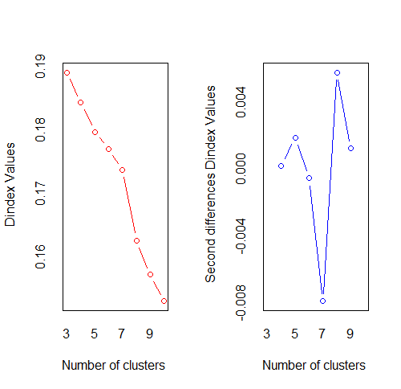

# Player Analysis

## Dataset

The data aggregated is scraped from the OUA website. Every box score per game per season is collected and aggregated so that there are player statistics for every season from 2014-15 to 2018-19 (this is because the Player Statistics came from the OUA website which has 2014-15 data).

## The Goal 

The goal is to use player statistics to gather insights on how players contribute to the game and how to categorize players using unsupervised learning.

## Data Preparation

The data is a subset of the player data with certain filters on the number of games played and the minutes per game. There are dataframes for every season from 2014-15 to 2018-19 with players that have played at least 15 games of at least 20 minutes per game. The games are regular season games from the U Sports division, Ontario University Athletics conference. All the variables are totals for the season except for PPG (Points per game) and MPG (Minutes per game)

```{r include=FALSE}
players.aggdf.reg<-read.csv('C:/Basketball/playeragg_reg.csv', header = T)
library(caret)
library(tidyverse)
season1<-players.aggdf.reg %>% filter(Season == "2014-15",GP >=15,MPG>=20)
season2<-players.aggdf.reg %>% filter(Season == "2015-16",GP >=15,MPG>=20)
season3<-players.aggdf.reg %>% filter(Season == "2016-17",GP >=15,MPG>=20)
season4<-players.aggdf.reg %>% filter(Season == "2017-18",GP >=15,MPG>=20)
season5<-players.aggdf.reg %>% filter(Season == "2018-19",GP >=15,MPG>=20)
```


```{r include=FALSE}
range01 <- function(x){(x-min(x))/(max(x)-min(x))}
s1<-range01(season1[,c(4:27)])
s1<-cbind(season1[,c(1:3)],s1)
s2<-range01(season2[,c(4:27)])
s2<-cbind(season2[,c(1:3)],s2)
s3<-range01(season3[,c(4:27)])
s3<-cbind(season3[,c(1:3)],s3)
s4<-range01(season4[,c(4:27)])
s4<-cbind(season4[,c(1:3)],s4)
s5<-range01(season5[,c(4:27)])
s5<-cbind(season5[,c(1:3)],s5)
```


## K-Means Clustering
First the data will be normalized in order to prepare the data for k-means clustering. This is helpful because some statistics have very different ranges e.g. the number of points compared to the number of steals. Therefore the variables will be comparable.

K-Means Clustering is a popular unsupervised machine learning algorithm. The goal of K-Means is to group similar data points in a dataset of unlabeled data. It does this by dividing the data into k clusters where each observation belongs to the cluster closest to the mean (cluster centroid) by using a distance metric (most usually Euclidean distance).

Since K-Means clustering is an unsupervised algorithm, this means that the number of clusters is not known. However, there are techniques that can be used to find an optimal number of clusters such as the gap method, silhouette method, within-cluster sum of squares method, D - index, etc. Different techniques and configurations of the techniques will be used for each season's clustering for finding the optimal number of clusters.

### K-Means Results

The technique that will be used to find the optimal number of clusters for the 2014-2015 season is the D-index method (Lebart et al. 2000). The D-index is based on clustering gain on intra-cluster inertia [8]. Intra-cluster inertia can be defined as: 


The clustering gain should be minimized. The optimal cluster configuration can be identified by the sharp knee that corresponds to a significant decrease of the first differences of clustering gain versus the number of clusters. This knee or great jump of gain values can be identified by a significant peak in second differences of clustering gain.

```{r message=FALSE, warning=FALSE, include=FALSE}
library(caret)
library(factoextra)
library(cluster)
library(NbClust)
```





In the plot of D-index, we seek a significant knee (the significant peak in D-index second differences plot) around 8, that corresponds to a significant increase of the value of measure.
The number of clusters that the method suggests is 8 clusters.


```{r echo=FALSE, fig.cap="Cluster Plot for 2014-15 Season. The axes are the Principal Components where Dim1 is the first PC and Dim2 is the second PC. The first PC explains 35.5% of the data and the second PC explains 18.5%."}
set.seed(6)
fit <- kmeans(s1[,c(4:27)], 8, nstart = 25) # 8 cluster solution
fviz_cluster(fit, data = s1[,c(4:27)])+ geom_text(aes(label=s1$Player),hjust=-0.1, vjust=0,size = 2)

```


```{r echo=FALSE, message=FALSE, warning=FALSE, comment=NA}
# get cluster means 
df<-aggregate(season1[,c(4:27)],by=list(fit$cluster),FUN=mean)
n <- names(t)

# transpose all but the first column (name)
df <- as.data.frame(t(df))
colnames(df) <- df[1, ]
df <- df[-1, ]
df$myfactor <- factor(row.names(df))
df<-df[,c(1:8)]
df<-round(df,2)
names(df)<-c('Cluster 1','Cluster 2', 'Cluster 3', 'Cluster 4', 'Cluster 5', 'Cluster 6', 'Cluster 7', 'Cluster 8')
rownames(df)<-c('3PointMade','3PointAttempted','Assists','Blocks','DefensiveRebounds','FieldGoalMade','FieldGoalAttempted','FreeThrowsMade','FreeThrowsAttempted','Minutes','OffensiveRebounds','PersonalFouls','Points','Rebounds','Steals','Turnovers','Home','GamesPlayed','PointsPerGame','MinutesPerGame','3P%','FG%','FT%','TrueShooting%') 

kable(df[,c(1:8)], caption = "Average of each variable for each cluster for the 2014-15 season") %>% kable_styling(font_size = 8)
```

```{r echo=FALSE, comment=NA}
mydata <- data.frame(season1[,c(2,3)], fit$cluster)
newdata <- mydata[order(fit$cluster),]
write.csv(newdata,'C:/Basketball/s1clusters.csv')
s1cluster<-read.csv('C:/Basketball/s1clusters.csv', header = T)[,c(2:4)]
names(s1cluster)<-c('Player','Team','Cluster')
```

```{r echo=FALSE, message=FALSE, warning=FALSE}
kable(s1cluster, caption = "Players from 2014-15 season with assigned clusters.")  %>%
  kable_styling(font_size = 8)
```


Each cluster can be categorized as a type of player.


Cluster 1: Efficient Playmakers & Scorers
This cluster of players have the most assists and the second most points per game. They have a big defensive impact through the number of steals they get and can control the tempo well and score.

Cluster 2: All-Around Players
These players can get rebounds, pass and score well.

Cluster 3: Dominant Big Men
These players are the most dominant big men in the league with the most rebounds (defensive and offensive), blocks, and points.

Cluster 4: Smart Catch & Shoot Players
These players make the best decisions and turnover the ball the fewest. They do not dribble the ball much and are the most efficient shooters.

Cluster 5: Aggressive Defenders
These players are aggressive and foul the most out of all the other clusters. They have a bigger impact on defense since they do not shoot well.

Cluster 6: Role Players
These players contribute to many plays and work both offensively and defensively.

Cluster 7: Second Tier Playmakers
These players are less dominant playmakers that can still score efficiently.

Cluster 8: Second Tier Small Players
These players play small but do not shoot as efficiently as the other players or create as many plays.


### 2015-16 Season

For this season, the elbow method [9] will be used to find the optimal number of clusters. The elbow method looks at the percentage of variance explained as a function of the number of clusters: One should choose a number of clusters so that adding another cluster does not give much better modeling of the data. More precisely, if one plots the percentage of variance explained by the clusters against the number of clusters, the first clusters will add much information (explain a lot of variance), but at some point the marginal gain will drop, giving an angle in the graph. The number of clusters is chosen at this point, hence the “elbow criterion”. This “elbow” cannot always be unambiguously identified.

```{r echo=FALSE, fig.cap="Elbow Method for finding the optimal number of clusters for the 2015-16 season "}
set.seed(6)
fviz_nbclust(s2[,c(4:27)], kmeans, method = "wss")+geom_vline(xintercept = 6, linetype = 2)+
  labs(subtitle = "Elbow method")
```

The number of clusters that will be used for this season is 6 for this season. Below are tables to show the average statistics for each cluster and also which players belong to which cluster.

```{r echo=FALSE, fig.cap="Cluster Plot of 2015-16 Season"}
fit <- kmeans(s2[,c(4:27)], 6, nstart = 25) 
fviz_cluster(fit, data = s2[,c(4:27)])+ geom_text(aes(label=s2$Player),hjust=-0.1, vjust=0, size=2)
```

```{r echo=FALSE, message=FALSE, warning=FALSE, comment=NA}
# get cluster means 
# get cluster means 
df<-aggregate(season2[,c(4:27)],by=list(fit$cluster),FUN=mean)
n <- names(t)

# transpose all but the first column (name)
df <- as.data.frame(t(df))
colnames(df) <- df[1, ]
df <- df[-1, ]
df$myfactor <- factor(row.names(df))
df<-df[,c(1:6)]
df<-round(df,2)
names(df)<-c('Cluster 1','Cluster 2', 'Cluster 3', 'Cluster 4', 'Cluster 5', 'Cluster 6')
rownames(df)<-c('3PointMade','3PointAttempted','Assists','Blocks','DefensiveRebounds','FieldGoalMade','FieldGoalAttempted','FreeThrowsMade','FreeThrowsAttempted','Minutes','OffensiveRebounds','PersonalFouls','Points','Rebounds','Steals','Turnovers','Home','GamesPlayed','PointsPerGame','MinutesPerGame','3P%','FG%','FT%','TrueShooting%') 

kable(df[,c(1:6)], caption = "Average of each variable for each cluster for the 2015-16 season") %>% kable_styling(font_size = 8)
```

```{r echo=FALSE, comment=NA}
mydata <- data.frame(season2[,c(2,3)], fit$cluster)
newdata <- mydata[order(fit$cluster),]
write.csv(newdata,'C:/Basketball/s2clusters.csv')
s2cluster<-read.csv('C:/Basketball/s2clusters.csv', header = T)[,c(2:4)]
names(s2cluster)<-c('Player','Team','Cluster')
```

```{r echo=FALSE, message=FALSE, warning=FALSE}
kable(s2cluster, caption = "Players from 2015-16 season with assigned clusters.")  %>% kable_styling(font_size = 8)
```


### 2016-17 Season


```{r echo=FALSE, fig.cap="Silhouette Method for finding the optimal number of clusters for the 2016-17 season "}
set.seed(10)
fviz_nbclust(s3[,c(4:27)], kmeans, method = "silhouette")
```

The Silhouette method suggests 2 as the optimal number of clusters for this season. This is possibly separating the players into forwards/centers and guards. Below are tables to show the average statistics for each cluster and also which players belong to which cluster.

```{r echo=FALSE, fig.cap="Cluster Plot of 2016-17 Season"}
fit <- kmeans(s3[,c(4:27)], 2, nstart = 25) 
fviz_cluster(fit, data = s3[,c(4:27)])+ geom_text(aes(label=s3$Player),hjust=-0.1, vjust=0, size=2)
```

```{r echo=FALSE, message=FALSE, warning=FALSE, comment=NA}
# get cluster means 
# get cluster means 
df<-aggregate(season3[,c(4:27)],by=list(fit$cluster),FUN=mean)
n <- names(t)

# transpose all but the first column (name)
df <- as.data.frame(t(df))
colnames(df) <- df[1, ]
df <- df[-1, ]
df$myfactor <- factor(row.names(df))
df<-df[,c(1:2)]
df<-round(df,2)
names(df)<-c('Cluster 1','Cluster 2')
rownames(df)<-c('3PointMade','3PointAttempted','Assists','Blocks','DefensiveRebounds','FieldGoalMade','FieldGoalAttempted','FreeThrowsMade','FreeThrowsAttempted','Minutes','OffensiveRebounds','PersonalFouls','Points','Rebounds','Steals','Turnovers','Home','GamesPlayed','PointsPerGame','MinutesPerGame','3P%','FG%','FT%','TrueShooting%') 

kable(df[,c(1:2)], caption = "Average of each variable for each cluster for the 2016-17 season")  %>% kable_styling(font_size = 8)
```


```{r echo=FALSE, comment=NA}
mydata <- data.frame(season3[,c(2,3)], fit$cluster)
newdata <- mydata[order(fit$cluster),]
write.csv(newdata,'C:/Basketball/s3clusters.csv')
s3cluster<-read.csv('C:/Basketball/s3clusters.csv', header = T)[,c(2:4)]
names(s3cluster)<-c('Player','Team','Cluster')
```

```{r echo=FALSE, message=FALSE, warning=FALSE}
kable(s3cluster, caption = "Players from 2016-17 season with assigned clusters.")  %>% kable_styling(font_size = 8)
```


### 2017-18 Season


The optimal number of clusters suggested by the D-index method is 5 for this season. This is possibly separating the players into the actual posistions (Point Guard, Shooting Guard, Small Forward, Power Forward, and Center).  Below are tables to show the average statistics for each cluster and also which players belong to which cluster.

```{r echo=FALSE, fig.cap="Cluster Plot of 2017-18 Season"}
fit <- kmeans(s4[,c(4:27)], 5, nstart = 25)
fviz_cluster(fit, data = s4[,c(4:27)])+ geom_text(aes(label=s4$Player),hjust=-0.1, vjust=0, size=2)
```

```{r echo=FALSE, message=FALSE, warning=FALSE, comment=NA}
# get cluster means 
# get cluster means 
df<-aggregate(season4[,c(4:27)],by=list(fit$cluster),FUN=mean)
n <- names(t)

# transpose all but the first column (name)
df <- as.data.frame(t(df))
colnames(df) <- df[1, ]
df <- df[-1, ]
df$myfactor <- factor(row.names(df))
df<-df[,c(1:5)]
df<-round(df,2)
names(df)<-c('Cluster 1','Cluster 2', 'Cluster 3', 'Cluster 4', 'Cluster 5')
rownames(df)<-c('3PointMade','3PointAttempted','Assists','Blocks','DefensiveRebounds','FieldGoalMade','FieldGoalAttempted','FreeThrowsMade','FreeThrowsAttempted','Minutes','OffensiveRebounds','PersonalFouls','Points','Rebounds','Steals','Turnovers','Home','GamesPlayed','PointsPerGame','MinutesPerGame','3P%','FG%','FT%','TrueShooting%') 

kable(df[,c(1:5)], caption = "Average of each variable for each cluster for the 2017-18 season") %>% kable_styling(font_size = 8)

```

```{r echo=FALSE, comment=NA}
mydata <- data.frame(season4[,c(2,3)], fit$cluster)
newdata <- mydata[order(fit$cluster),]
write.csv(newdata,'C:/Basketball/s4clusters.csv')
s4cluster<-read.csv('C:/Basketball/s4clusters.csv', header = T)[,c(2:4)]
names(s4cluster)<-c('Player','Team','Cluster')
```

```{r echo=FALSE, message=FALSE, warning=FALSE}
kable(s4cluster, caption = "Players from 2017-18 season with assigned clusters.") %>% kable_styling(font_size = 8)
```

### 2018-19 Season


The optimal number of clusters suggested for the 2018-19 season is 4. Below are tables to show the average statistics for each cluster and also which players belong to which cluster.

```{r echo=FALSE, fig.cap="Cluster Plot of 2018-19 Season"}
fit <- kmeans(s5[,c(4:27)], 4, nstart = 25)
fviz_cluster(fit, data = s5[,c(4:27)])+ geom_text(aes(label=s5$Player),hjust=-0.1, vjust=0, size=2)
```

```{r echo=FALSE, message=FALSE, warning=FALSE, comment=NA}
# get cluster means 
df<-aggregate(season5[,c(4:27)],by=list(fit$cluster),FUN=mean)
n <- names(t)

# transpose all but the first column (name)
df <- as.data.frame(t(df))
colnames(df) <- df[1, ]
df <- df[-1, ]
df$myfactor <- factor(row.names(df))
df<-df[,c(1:4)]
df<-round(df,2)
names(df)<-c('Cluster 1','Cluster 2', 'Cluster 3', 'Cluster 4')
rownames(df)<-c('3PointMade','3PointAttempted','Assists','Blocks','DefensiveRebounds','FieldGoalMade','FieldGoalAttempted','FreeThrowsMade','FreeThrowsAttempted','Minutes','OffensiveRebounds','PersonalFouls','Points','Rebounds','Steals','Turnovers','Home','GamesPlayed','PointsPerGame','MinutesPerGame','3P%','FG%','FT%','TrueShooting%') 

kable(df[,c(1:4)], caption = "Average of each variable for each cluster for the 2018-19 season") %>% kable_styling(font_size = 8)
```

```{r echo=FALSE, comment=NA}
mydata <- data.frame(season5[,c(2,3)], fit$cluster)
newdata <- mydata[order(fit$cluster),]
write.csv(newdata,'C:/Basketball/s5clusters.csv')
s5cluster<-read.csv('C:/Basketball/s5clusters.csv', header = T)[,c(2:4)]
names(s5cluster)<-c('Player','Team','Cluster')
```

```{r echo=FALSE, message=FALSE, warning=FALSE}
kable(s5cluster, caption = "Players from 2018-19 season with assigned clusters.") %>% kable_styling(font_size = 8)
``` 

## Conclusion

Unsupervised learning used on basketball data can be very helpful. It can be used to categorize players and to see what their style of play is. It can also be used for match-ups and for predicting important players. For instance, if you find that a player was in the same cluster as the catch and shoot players, a coach can assign an appropriate defender. Knowing the style of play for your opponents is very useful for defensive purposes. In my opinion the higher the number of clusters assigned, the better because it would distinguish the type of player more. 

