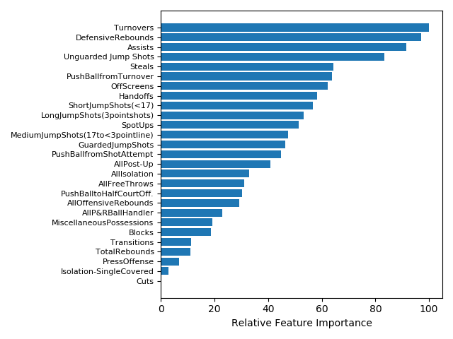

# Classification of Wins

In machine learning and statistics, classification is a supervised learning approach in which the machine learns from the data input given to it and then uses this learning to classify new observations. In this case, classification can be used to identify a win and loss and also to predict whether a game will be a win or loss. That means we want to identify which variables are the most important in distinguishing a win (or a loss_. 
There are many types of classification techniques such as Random Forests, Support Vector Machines, Logistic Regression, XGBoost, etc.. 
 
## Random Forests

Random forest is an ensemble learning method for classification. Ensemble methods are very effective because they use multiple learning algorithms to obtain better predictive performance than could be obtained from any of the learning algorithms alone. 
A random forest consists of a large number of decision trees that operate as an ensemble. Each individual tree in the random forest gives a prediction of outcome and the class with the most votes becomes the model’s prediction[11].
The reason why a random forest is a great technique is because a large number of relatively uncorrelated models (trees) operating as a committee will outperform any of the individual constituent models.
Random forests also give an importance score for all the features used in the model. A standard procedure is to first use all the variables and then use feature importance to narrow the model down to get more accurate results.

### Model 1
```{r include=FALSE}
library(reticulate)
```

```{python include=FALSE}
import pandas as pd
import numpy as np
import matplotlib.pyplot as plt
import seaborn as sns
from sklearn.ensemble import RandomForestClassifier
from sklearn.model_selection import train_test_split
from sklearn import metrics
```


```{python, include=FALSE}
synergy = pd.read_csv('allfeatures.csv', header=0)
X = synergy.drop(columns=['ID', 'Team', 'AfterTimeOuts(ATO)', 'HalfCourtSetAll',
       'HalfCourtSetAll-NoPts', 'HalfCourtSetAll-Pts',
       'HalfCourtSetvs.Zone-NoPts', 'HalfCourtSetvs.Man',
       'HalfCourtSetvs.Man-NoPts', 'HalfCourtSetvs.Man-Pts',
       'HalfCourtSetvs.Zone', 'HalfCourtSetvs.Zone-Pts',
       'Last4Sec.ofShotClock', 'OutofBounds', 'OutofBounds(End)',
       'OutofBounds(Side)', 'TotalPoints', 'Win', 'Season',
       'AllPushBall','2FGAttempts', '2FGMade', '2FGMissed', '3FGAttempts', '3FGMade',
       '3FGMissed','FGAttempts', 'FGMade', 'FGMissed','LiveFreeThrows','AllIsolation', 'AllOffensiveRebounds',
       'AllP&RBallHandler', 'AllPossessionClips', 'AllPost-Up','NoPoints', 'NonPossessions','Points','StolenPossessions'])
y = synergy[['Win']]
X_train, X_test, y_train, y_test = train_test_split(X, y, test_size=0.3)

clf=RandomForestClassifier(n_estimators=1000,random_state = np.random.seed(1234))

clf.fit(X_train,y_train.values.ravel())

y_pred=clf.predict(X_test)


```

In this random forest model we are predicting wins using the following predictors: Assists,DefensiveRebounds,TotalRebounds,Turnovers,PushBallfromTurnover,Steals,
PressOffense,UnguardedJumpShots,AllFreeThrows,P&RBallHandler-SingleCovered,Cuts,
GuardedJumpShots,ShortJumpShots,TransitionOffense,LongJumpShots,Transitions,SpotUps,
P&RBallHandler-DefenseCommits,PushBallfromShotAttempt,PushBalltoHalfCourtOff.,
OffensiveRebounds,MiscellaneousPossessions,Isolation-SingleCovered,Post-Up-SingleCovered,
MediumJumpShots,Blocks,OffScreens,Off.Reb.-PutBacks,Handoffs,Off.Reb.-ResetOffense,
TransitionTurnover,P&RRollMan,Isolation-DefenseCommits,Post-Up-DefenseCommits,
Post-Up-HardDoubleTeam,P&RBallHandler-Traps. The model is trained on a train set which is a random sample (without replacement) of 70% of the dataset and tested on a random sample of 30% of the dataset. The accuracy score is obtained below.

```{python echo=FALSE, comment=NA}
print("Accuracy:",metrics.accuracy_score(y_test, y_pred))
```

A very important perk of the random forest algorithm is it allows us to obtain the Feature importance to let us know which variables were the most important for creating the model, i.e. which features are the most important in classifying and predicting wins. A table of the Feature importance from this model is shown below.

Feature			                 |	Feature Importance Value
-----------------------------|--------------------
Assists                      |   0.096881
DefensiveRebounds            |   0.062817
TotalRebounds                |   0.059851
Turnovers                    |   0.056744
PushBallfromTurnover         |   0.044454
Steals                       |   0.038865
PressOffense                 |   0.037174
Unguarded Jump Shots         |   0.030118
AllFreeThrows                |   0.029086
P&RBallHandler-SingleCovered |   0.028485
Cuts                         |   0.027246
GuardedJumpShots             |   0.026854
ShortJumpShots               |   0.025915
TransitionOffense            |   0.025691
LongJumpShots                |   0.023443
Transitions                  |   0.023180
SpotUps                      |   0.023102
P&RBallHandler-DefenseCommits|   0.022575
PushBallfromShotAttempt      |   0.022505
PushBalltoHalfCourtOff.      |   0.022279
OffensiveRebounds            |   0.022109
MiscellaneousPossessions     |   0.020995
Isolation-SingleCovered      |   0.020878
Post-Up-SingleCovered        |   0.020679
MediumJumpShots              |   0.019900
Blocks                       |   0.019759
OffScreens                   |   0.018904
Off.Reb.-PutBacks            |   0.017528
Handoffs                     |   0.017504
Off.Reb.-ResetOffense        |   0.017282
TransitionTurnover           |   0.017150
P&RRollMan                   |   0.015011
Isolation-DefenseCommits     |   0.013565
Post-Up-DefenseCommits       |   0.013291
Post-Up-HardDoubleTeam       |   0.012348
P&RBallHandler-Traps         |   0.005832

Table: Feature Importance of Random Forest Model 1


Note: since random forests take samples randomly, the accuracy will vary depending on the seed chosen.

### Model 2
```{python include=FALSE}
X = synergy.drop(columns=['ID', 'Team', 'AfterTimeOuts(ATO)', 'HalfCourtSetAll',
       'HalfCourtSetAll-NoPts', 'HalfCourtSetAll-Pts',
       'HalfCourtSetvs.Zone-NoPts', 'HalfCourtSetvs.Man',
       'HalfCourtSetvs.Man-NoPts', 'HalfCourtSetvs.Man-Pts',
       'HalfCourtSetvs.Zone', 'HalfCourtSetvs.Zone-Pts',
       'Last4Sec.ofShotClock', 'OutofBounds', 'OutofBounds(End)',
       'OutofBounds(Side)', 'TotalPoints', 'Win', 'Season',
       'AllPushBall','2FGAttempts', '2FGMade', '2FGMissed', '3FGAttempts', '3FGMade','Isolation-DefenseCommits',
       '3FGMissed','FGAttempts', 'FGMade', 'FGMissed','LiveFreeThrows', 'OffensiveRebounds',
       'P&RBallHandler-SingleCovered','P&RBallHandler-DefenseCommits','P&RBallHandler-Traps', 'AllPossessionClips',
       'NoPoints', 'NonPossessions','Points','StolenPossessions','Post-Up-HardDoubleTeam','Post-Up-DefenseCommits',
       'P&RRollMan', 'Off.Reb.-PutBacks','Off.Reb.-ResetOffense','TransitionTurnover','Post-Up-SingleCovered','TransitionOffense'])


y = synergy[['Win']]
X_train, X_test, y_train, y_test = train_test_split(X, y, test_size=0.3)

clf=RandomForestClassifier(n_estimators=1000,random_state = np.random.seed(1234))

clf.fit(X_train,y_train.values.ravel())

y_pred=clf.predict(X_test)


```

In this random forest model we are predicting wins using a refined selection of predictors: Assists,DefensiveRebounds,TotalRebounds,Turnovers,Steals,PushBallfromTurnover,PressOffense,AllFreeThrows,UnguardedJumpShots,ShortJumpShots,Cuts,LongJumpShots,
Transitions,GuardedJumpShots,PushBallfromShotAttempt,AllP&RBallHandler,SpotUps,
AllPost-Up,PushBalltoHalfCourtOff.,AllOffensiveRebounds,MiscellaneousPossessions,
AllIsolation,OffScreens,Blocks,MediumJumpShots,Isolation-SingleCovered,Handoffs.The model is trained on a train set which is a random sample (without replacement) of 70% of the dataset and tested on a random sample of 30% of the dataset. The accuracy score is obtained below.

```{python echo=FALSE,comment=NA}
print("Accuracy:",metrics.accuracy_score(y_test, y_pred))
```

A very valuable component of the Random Forest algorithm is feature importance. Since a Random Forest is a collection of Decision trees and so the splitting criterion used to choose which variable to split on is used to rank the importance of variables. For example, if the decision tree first splits using the Assists variable for most of the decision trees, then Assists would be an important variable. The decision tree creates splits by identifying the variables which create the best homogeneous sets.

A table of the Feature importance from this model is shown below

Feature			            |  Feature Importance Value
------------------------|---------------------------
**Assists**             |   **0.103865**
DefensiveRebounds       |   0.079669
TotalRebounds           |   0.064047
Turnovers               |   0.062428
Steals                  |   0.059118
PushBallfromTurnover    |   0.048081
PressOffense            |   0.039639
AllFreeThrows           |   0.034666
Unguarded Jump Shots    |   0.033493
ShortJumpShots          |   0.032340
Cuts                    |   0.031976
LongJumpShots           |   0.030290
Transitions             |   0.029443
GuardedJumpShots        |   0.029287
PushBallfromShotAttempt |   0.028180
AllP&RBallHandler       |   0.028030
SpotUps                 |   0.027917
AllPost-Up              |   0.027047
PushBalltoHalfCourtOff. |   0.025952
AllOffensiveRebounds    |   0.025533
MiscellaneousPossessions|   0.024643
AllIsolation            |   0.024239
OffScreens              |   0.023363
Blocks                  |   0.022834
MediumJumpShots         |   0.022212
Isolation-SingleCovered |   0.021883
Handoffs                |   0.019824

Table: Feature Importance of Random Forest Model 2

Assists are the most important feature in both models for classifying whether a game is a win or loss.

## Logistic Regression

Logistic Regression is a form of regression that is used when the response variable is a  categorical variable [12]. In this case it is a binary value (e.g. Success or Failure). The game by game data can be used to create a model that predicts Wins.

### Model
```{python include=FALSE}
from sklearn.linear_model import LogisticRegression
clf = LogisticRegression(random_state=0, solver='lbfgs', max_iter=1000)
clf.fit(X_train,y_train.values.ravel())
y_pred=clf.predict(X_test)

```

The same features are used in this model as the second model in the Random Forests section. Logistic regression will be used to classify and then predict wins. The equation is below

$$ Win = \beta_0 + {\beta_1*Assists} + ... + {\beta_{27}*Handoffs} $$

Again, the model is trained on a train set which is a random sample (without replacement) of 70% of the dataset and tested on a random sample of 30% of the dataset. The accuracy score is obtained below.

```{python echo=FALSE, comment=NA}
print("Accuracy:",metrics.accuracy_score(y_test, y_pred))
```




The feature importance from Logistic Regression differs from Random Forests.Although, Defensive Rebounds, Assists, and Turnovers are still on the top of the list. In general, turnovers negatively impact teams and can be an important feature to distinguish teams that are less likely to win if they make more turnovers.

### Assists

A dataset has been modified to subtract the home team's statistics from the away team's statistics for each game so that there are differential statistics. 
The differential statistics were compared to see which contributed to the highest proportion of wins.


Differential Statistics           | Proportion of Wins
----------------------------------|-----------------------------------------------
Positive Assists Differential     | 845/1171 = 72.2% 
Positive Rebounds Differential    | 817/1171 = 69.8%
Negative Turnovers Differential   | 726/1171 = 62%

Table: Differential Statistics & Proportion of Wins

#### Risk Ratio & Odds Ratio

```{r echo=FALSE, comment=NA}

c.table<-array(data = c(845,326,326,845), dim = c(2,2), 
          dimnames = list(Group = c("Positive Assists Differential", "Negative Assists Differential"),
                          Outcome = c("Win", "Lose")))
twoby2(c.table, alpha = 0.05)
```
Above is a two-by-two table analysis. The Sample Odds Ratio tells us that odds of a team winning is 6.7 higher given they have more assists than their opponent compared to teams that have fewer assists than their opponent. The Relative Risk tells us that teams with more assists than their opponent have 2.59 times the 'risk' of winning compared to teams with fewer assists than their opponent.


### Why are Assists so important?
Assists can lead to effective scoring. A player is getting set up for a shot and each team can distribute their shots differently. A study was done in the NBA (Pelechrinis, Konstantinos, 2019) [13] that has shown that on average an assisted shot added 0.16 expected points more compared to an unassisted shot. If teams looked for the extra pass on 15 of their unassisted shots, this corresponds to approximately 2.4 additional expected points over the course of the game. An assist can increase the average field goal percentage of a type of shot as opposed to an unassisted shot (Pelechrinis, Konstantinos, 2019). Also, assists are necessary for effective play making. As seen previously, transitions, spot-ups and cuts are all very effective offensive plays and the thing that connects them together is an assist.

#### Shots Derived From Assists

Using Synergy's Multi-Game Shot Chart it is possible to see the difference in shooting efficiency between shots derived from an assist and shots that were not.


```{r, echo=FALSE,out.width="49%", out.height="50%", fig.cap="Side-by-Side shot chart of Carleton's 2018-19 season. The left side is the shot chart of the entire season without any filters. The right side shows the chart of the entire season where shots were derived from passing plays.", fig.show='hold', fig.align='center'}
knitr::include_graphics(c("images/carl201819.png","images/carleton201819pass.png"))
```


## Conclusion

To summarise, both classification algorithms work well. However, the Logistic Regression has a better accuracy along with better interpretability and usability. Both algorithms lead to similar feature importance. Also, the feature importance is a very valuable component to these machine learning algorithms since it shows the most important characteristics associated with the target variable (in this case it is Wins).