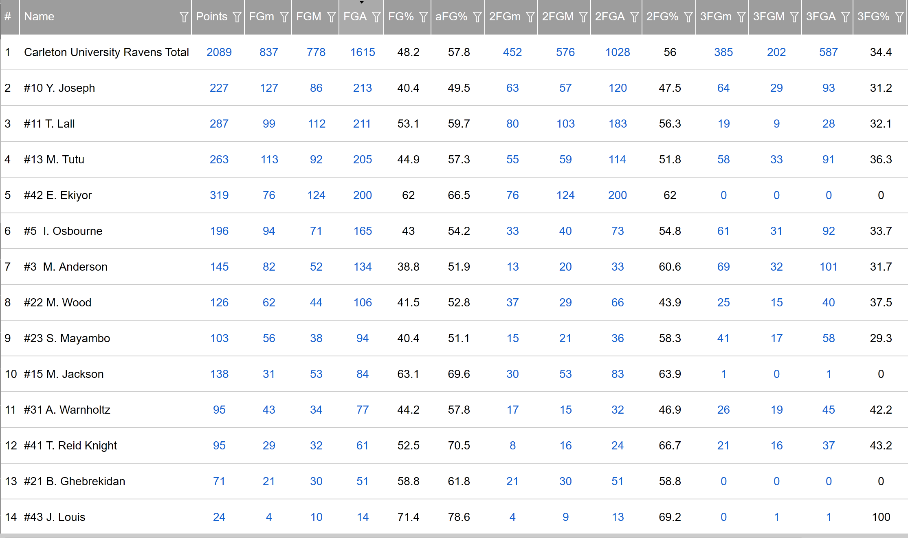
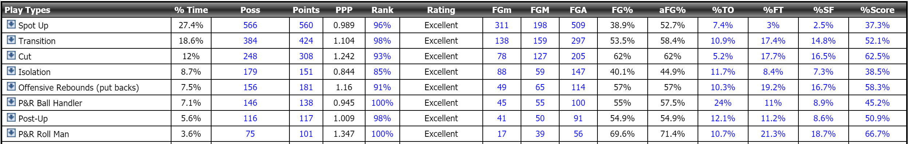
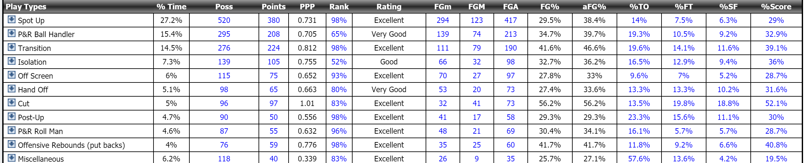

# Carleton

Carleton has been a strong team for over the past decade. They have won 14 of the last 17 U Sports national championships (2003-2007, 2009, 2011-2017, 2019) due to remarkable coaching and great roster.

## Dave Smart Effect

The Raven's head coach Dave Smart has a lot to do with the success of the team, as he has led them to 13 of their 14 championships between 1999 (his first year as coach) to 2019. From 2003 to 2007 inclusive, Smart led the Ravens to five consecutive Canadian Interuniversity Sport (CIS) national championships, which were the first CIS championships won by Carleton in any sport.[6] He has been head coach for all seasons since 1999 except for 2015-2016, during which he was on sabbatical leave. Below we analyze data from 2015 to 2019, from which it can even be deduced that his absence affected the team's performance.

```{r include=FALSE}
library(tidyverse)
```


```{r echo=FALSE, fig.cap="Carleton Wins Per Season.", message=FALSE, warning=FALSE}
carleton<-read.csv('C:/Basketball/carleton.csv', header = T)
teamagg<-read.csv('C:/Basketball/TeamAgg.csv',header = T)
carletonprop<-read.csv('C:/Basketball/carletonprop.csv',header = T)
carleton.reg<-teamagg %>% filter(Team == "Carleton")
ggplot(carleton.reg, aes(fill=Season, y=Wins, x=Season)) + 
  geom_bar(position="dodge", stat="identity") +
  labs(title="Win Frequency", 
       subtitle="Total Wins Per Season") + 
  theme(axis.text.x = element_text(angle=90, vjust=0.3))
```

The Ravens won the fewest regular season games in the 2015-2016 season when Dave Smart took a sabbatical (his nephew, Rob Smart was the interim coach). The team had also lost four starters from the previous year's championship. It is evident that these two factors greatly affected the Raven's performance throughout that season.

### Comparing Play Types
```{r include=FALSE}
library(gridExtra)
```

```{r echo=FALSE, fig.cap="Carleton Play Types Proportionate to Total Possessions Comparison Per Season"}
knit_hooks$set(crop = hook_pdfcrop)
opts_chunk$set(crop = TRUE)
plota<-ggplot(carletonprop, aes(x=Season, y=carletonprop$AllPostUp))+
  geom_bar(stat="identity", color="blue", fill="blue")+
  labs(title="Post-Ups", 
       subtitle="Total Post-Up Plays(%) Per Season",
        caption = "(i)")+ 
  theme(axis.text.x = element_text(angle=90, vjust=0.3))+
  xlab('Season') +
  ylab('Post-Up Plays')
plotb<-ggplot(carletonprop, aes(x=Season, y=carletonprop$AllIsolation))+
  geom_bar(stat="identity", color="red", fill="red")+
    labs(title="Isolation", 
       subtitle="Total Isolation Plays(%) Per Season",caption = "(ii)") + 
  theme(axis.text.x = element_text(angle=90, vjust=0.3))+
  xlab('Season') +
  ylab('Isolation Plays')
plotc<-ggplot(carletonprop, aes(x=Season, y=carletonprop$Transitions))+
  geom_bar(stat="identity", color="blue", fill="blue")+
      labs(title="Transitions", 
       subtitle="Total Transition Plays(%) Per Season", caption = "(iii)") + 
  theme(axis.text.x = element_text(angle=90, vjust=0.3))+
  xlab('Season') +
  ylab('Transition Plays')
plotd<-ggplot(carletonprop, aes(x=Season, y=carletonprop$TransitionTurnover))+
  geom_bar(stat="identity", color="red", fill="red")+
        labs(title="Transition Turnovers", 
       subtitle="Total Transition Turnovers(%) Per Season", caption = "(iv)") + 
  theme(axis.text.x = element_text(angle=90, vjust=0.3))+
  xlab('Season') +
  ylab('Transition Turnovers')
grid.arrange(plota, plotb, plotc, plotd, ncol=2,nrow=2)
```

Barplot (i) illustrates that the 2015/2016 season had significantly more Post-Up plays. This could be a preference of coach Rob Smart due to a larger roster or could be his preferred style of play in general.
The 2015/2016 season had the fewest isolation plays (ii) but not a significant change from the 2016/2017 season.
The 2015/2016 season had the most transition turnovers(iv) (transition plays resulting in a turnover) along with the 2016-2017 season.


#### Statistical Proportion Test

A Test Of Equal Or Given Proportions can be used for testing the null that the proportions in several groups are the same, or that they equal certain given values. This can be used to see if the the 2015-16 season is statistically significant compared to the other seasons for the above play types.

#### Proportion Testing Post-Up Plays
```{r include=FALSE}
library(stats)
```

```{r echo=FALSE, comment=NA}
prop.test(carleton$AllPostUp,carleton$AllPossessionClips)
```

```{r echo=FALSE, comment=NA}
pairwise.prop.test(carleton$AllPostUp,carleton$AllPossessionClips)
```

This shows that the pairs including the 2015-2016 season are statistically significant.

#### Proportion Testing Isolation Plays
```{r echo=FALSE, comment=NA}
prop.test(carleton$AllIsolation,carleton$AllPossessionClips)
```

```{r echo=FALSE, comment=NA}
pairwise.prop.test(carleton$AllIsolation,carleton$AllPossessionClips)
```
The 2018-2019 season has statistically significant pairs compared to the rest.

#### Proportion Testing Transition Plays
```{r echo=FALSE, comment=NA}
prop.test(carleton$Transitions,carleton$AllPossessionClips)
```

```{r echo=FALSE, comment=NA}
pairwise.prop.test(carleton$Transitions,carleton$AllPossessionClips)
```

Only the 2016-2017 season compared to the 2018-2019 season is statistically significant.

#### Proportion Testing Transition Turnovers Plays
```{r echo=FALSE, comment=NA}
prop.test(carleton$TransitionTurnover,carleton$AllPossessionClips)
```

```{r echo=FALSE, comment=NA}
pairwise.prop.test(carleton$TransitionTurnover,carleton$AllPossessionClips)
```


Prop1 is the 2015-2016 season, Prop 2 is the 2016-2017 season, Prop3 is the 2017-2018 season, and Prop4 is the 2018-2019 season.
All the p-values are less than 0.05 which tells us that the proportion is not the same for each season,i,e. at least one season is different from the others. However this does not mean the 2015-16 season is the one that is statistically different from the rest. It is only the case for Post-Up plays that the 2015-16 season is statistically different from all the others. It is also the most significant difference with an X-squared value of 85.565. For Isolation it is the 2018-19 season that is statistically different from the rest.


### Comparing Pace

```{r echo=FALSE, fig.cap="Carleton Pace Per Season"}
ggplot(carletonprop, aes(x=Season, y=carletonprop$AllPushBall))+
  geom_bar(stat="identity", color="blue", fill="blue")+
          labs(title="Push Ball Frequency", 
       subtitle="Proportion of Higher Paced Plays Per Season") + 
  theme(axis.text.x = element_text(angle=90, vjust=0.3))+
  xlab('Season') +
  ylab('Push Ball')
  

```


This barplot illustrates that the 2015/2016 Ravens pushed the ball the fewest and as a result had a slower pace on average.

#### Statistical Proportion Tests

#### Proportion Testing Pace
```{r echo=FALSE, comment=NA}
prop.test(carleton$AllPushBall,carleton$AllPossessionClips)
```
The p-value is less than 0.05 which tells us that the proportion is not the same for each season,i,e. at least one season is different from the others.

```{r echo=FALSE, comment=NA}
pairwise.prop.test(carleton$AllPushBall,carleton$AllPossessionClips)
```


This shows that the 2015-16 season pushed the ball significantly fewer times compared to the other seasons except for the 2018-2019 season.


### Comparing Shot Types

```{r echo=FALSE, fig.cap="Carleton Shot Types Per Season"}
knit_hooks$set(crop = hook_pdfcrop)
opts_chunk$set(crop = TRUE)
plot1<-ggplot(carletonprop, aes(x=Season, y=carletonprop$LongJumpShots))+
  geom_bar(stat="identity", color="red", fill="red") + 
            labs(title="Long Jump Shots Proportion", 
       subtitle="Proportion of Long Jump Shots Per Season") + 
  theme(axis.text.x = element_text(angle=90, vjust=0.3))+
  xlab('Season') +
  ylab('Long Jump Shots (3 pointers)')
plot2<-ggplot(carletonprop, aes(x=Season, y=carletonprop$MediumJumpShots))+
  geom_bar(stat="identity", color="red", fill="red") +
  labs(title="Medium Jump Shots Proportion", 
       subtitle="Proportion of Medium Jump Shots Per Season") + 
  theme(axis.text.x = element_text(angle=90, vjust=0.3))+
  xlab('Season') +
  ylab("Medium Jump Shots (17' < 3 point)")
grid.arrange(plot1, plot2, ncol=2)
  
```

The 2015/2016 Ravens had the fewest 3 pointers and significantly more medium jump shots (these are jump shots from 17 ft to behind the 3 point line).

#### Statistical Proportion Test

#### Proportion Testing Long Jump Shots
```{r echo=FALSE, comment=NA}
prop.test(carleton$LongJumpShots,carleton$AllPossessionClips)
```
The p-value is less than 0.05 which tells us that the proportion is not the same for each season,i,e. at least one season is different from the others. 

```{r echo=FALSE, comment=NA}
pairwise.prop.test(carleton$LongJumpShots,carleton$AllPossessionClips)
```


This shows that the 2015-16 season shot 3-pointers significantly fewer times compared to the other seasons except for the 2018-2019 season.

#### Proportion Testing Medium Jump Shots
```{r echo=FALSE, comment=NA}
prop.test(carleton$MediumJumpShots,carleton$AllPossessionClips)
```
The p-value is less than 0.05 which tells us that the proportion is not the same for each season,i,e. at least one season is different from the others. 

```{r echo=FALSE, comment=NA}
pairwise.prop.test(carleton$MediumJumpShots,carleton$AllPossessionClips)
```


This shows that the 2015-16 season took significantly more medium jump shots than the other seasons except for the 2016-2017 season.

### Comparing Bench Points

```{r echo=FALSE, fig.cap="Carleton Bench Points Per Season"}
ggplot(carleton.reg, aes(x=Season, y=(carleton.reg$BenchPointsProportion/carleton.reg$TotalPoints)*100))+
  geom_bar(stat="identity", color="blue", fill="blue") + 
    labs(title="Bench Points", 
       subtitle="Proportion of Bench Points Per Season") + 
  theme(axis.text.x = element_text(angle=90, vjust=0.3))+
  xlab('Season') +
  ylab('Bench Points')
```
This barplot shows that the 2015/2016 Ravens had the fewest bench points which could suggest that the coach did not utilize his bench players as much. Also it can suggest something about the skills of the bench players during that season compared to the other seasons.


#### Statistical Proportion Test

#### Proportion Testing Bench Points
```{r echo=FALSE, comment=NA}
prop.test(carleton.reg$BenchPoints,carleton.reg$TotalPoints)
```

The p-value is less than 0.05 which tells us that the proportion is not the same for each season,i,e. at least one season is different from the others. 

```{r echo=FALSE, comment=NA}
pairwise.prop.test(carleton.reg$BenchPoints,carleton.reg$TotalPoints)
```


This shows that the 2015-16 season had significantly fewer bench points than the other seasons. This could be due to the coach preferring to play his starters for most of the game.


## Decision Tree

Carleton is a very successful team. Carleton has played 89 games from 2015-16 season to the 2018-19 season, of which they have only lost 7 of them. Using a decision tree, we can find where Carleton has lost their games. A decision tree is a decision support tool that uses a tree-like graph or model of decisions and their possible consequences, in this case the consequence is a game loss. The paths from root to leaf represent classification rules [7].


### Play Types Decision Tree
```{r include=FALSE}
library(tidyverse)
library(caret)
library(rpart)
library(rpart.plot)
```

```{r echo=FALSE, fig.cap="Carleton Classification Tree for Wins using Play Type Data on all Seasons vs Classification Tree for Wins using Play Type Data excluding 2015-2016 Season. Note: 0 denotes loss and 1 denotes a win"}
knit_hooks$set(crop = hook_pdfcrop)
opts_chunk$set(crop = TRUE)
par(mfrow=c(1,2))
allfeats<-read.csv('C:/Basketball/allfeatures.csv', header = T)
carleton.syn<-allfeats %>% filter(Team == "Carleton University Ravens")
carleton.syn$Win<-as.factor(carleton.syn$Win)
carleton.tree<-rpart(Win ~ Transitions +  AllIsolation +
                      AllOffensiveRebounds + AllP.RBallHandler +
                      AllPost.Up + Cuts + Handoffs + MiscellaneousPossessions +                      SpotUps, data = carleton.syn,control=rpart.control(minsplit=2, minbucket=1, cp=0.001))
rpart.plot(carleton.tree, main="Classification Tree for Wins", box.palette = 0)
carleton.no2015<-carleton.syn %>% filter(Season != "2015-2016")
carleton.2015<-carleton.syn %>% filter(Season == "2015-2016")
carleton.tree<-rpart(Win ~ Transitions +  AllIsolation +
                      AllOffensiveRebounds + AllP.RBallHandler +
                      AllPost.Up + Cuts + Handoffs + MiscellaneousPossessions +                      SpotUps, data = carleton.no2015,control=rpart.control(minbucket=1, cp=0.001))
rpart.plot(carleton.tree, main="Classification Tree for Wins without 2015-2016 Season", cex.main = .7, box.palette = 0)


```
Using the tree on the left we can see that Carleton has lost games when they have done more than 17 Post plays **or** fewer than 17 Post plays but with low Transition plays and low Cuts. They have also lost when they have a high number of post plays but few pick and roll plays. 
If we exclude the 2015-2016 season, the number of branches in the classification tree becomes reduced. Carleton has lost games when they made 15 Pick and Roll Ball Handler plays, and then fewer than six Post-Up plays.

```{r echo=FALSE, fig.cap="Carleton Classification Tree for Wins using Play Type Data on Seasons with Dave Smart vs Classification Tree for Wins using Play Type Data on Season without Dave Smart. Note: 0 denotes loss and 1 denotes a win"}
par(mfrow=c(1,2))


carleton.tree<-rpart(Win ~ Transitions +  AllIsolation +
                      AllOffensiveRebounds + AllP.RBallHandler +
                      AllPost.Up + Cuts + Handoffs + MiscellaneousPossessions +                      SpotUps, data = carleton.2015,control=rpart.control(minbucket=1, cp=0.001))
rpart.plot(carleton.tree, main="Classification Tree for Wins for only 2015-2016 Season", cex.main = .7, box.palette = 0)

carleton.tree<-rpart(Win ~ Transitions +  AllIsolation +
                      AllOffensiveRebounds + AllP.RBallHandler +
                      AllPost.Up + Cuts + Handoffs + MiscellaneousPossessions +                      SpotUps, data = carleton.no2015,control=rpart.control(minbucket=1, cp=0.001))
rpart.plot(carleton.tree, main="Classification Tree for Wins without 2015-2016 Season", cex.main = .7, box.palette = 0)
```

In the figure on the left is a classification tree for the Season Dave Smart was not coaching. That team won 79% of games and they have lost 16% of their games when they had fewer than 14 transitions and lost the remaining 5% when took more than 30 Spot-Ups.
In the figure on the right is a classification tree for the Seasons Dave Smart was coaching. That team won 98% of games and lost their game(s) only when they performed 14 Pick & Roll Ball Handler plays and fewer than 6 Post-Up plays. This is a very specific loss.

### Shot Types Decision Tree
```{r echo=FALSE, fig.cap="Carleton Classification Tree for Wins using Shots Data"}
knit_hooks$set(crop = hook_pdfcrop)
opts_chunk$set(crop = TRUE)
par(mfrow=c(1,2))
carleton.tree<-rpart(Win ~  ShortJumpShots + MediumJumpShots + GuardedJumpShots + LongJumpShots + AllFreeThrows, data = carleton.syn, ,control=rpart.control(minsplit=2, minbucket=1, cp=0.001))
rpart.plot(carleton.tree, main="Classification Tree for Wins", box.palette = 0)
carleton.tree<-rpart(Win ~  ShortJumpShots + MediumJumpShots + GuardedJumpShots + LongJumpShots + AllFreeThrows, data = carleton.no2015, ,control=rpart.control(minsplit=2, minbucket=1, cp=0.001))
rpart.plot(carleton.tree, main="Classification Tree for Wins without 2015-2016 Season", cex.main = .7, box.palette = 0)

```

On the left tree, we see that Ravens lost when they scored a low number of 3 pointers and also when they take a lot of guarded jump shots (this is considering all the seasons from 2015 to 2019). When we exclude the 2015-2016 season, the Ravens lost their games when they scored less than 12 free throws, shot more than six short jump shots, and less than one medium jump shot. They have won all games with more than 12 free throws taken. The more fouls Carleton draws, the more probable they will win.

```{r echo=FALSE, fig.cap="Carleton Classification Tree for Wins using Shots Data on Seasons with Dave Smart vs Classification Tree for Wins on Season without Dave Smart. Note: 0 denotes loss and 1 denotes a win"}
knit_hooks$set(crop = hook_pdfcrop)
opts_chunk$set(crop = TRUE)
par(mfrow=c(1,2))
carleton.tree<-rpart(Win ~  ShortJumpShots + MediumJumpShots + GuardedJumpShots + LongJumpShots + AllFreeThrows, data = carleton.2015, ,control=rpart.control(minsplit=2, minbucket=1, cp=0.001))
rpart.plot(carleton.tree, main="Classification Tree for Wins for only 2015-2016 Season",cex.main = .6, box.palette = 0)
carleton.tree<-rpart(Win ~  ShortJumpShots + MediumJumpShots + GuardedJumpShots + LongJumpShots + AllFreeThrows, data = carleton.no2015, ,control=rpart.control(minsplit=2, minbucket=1, cp=0.001))
rpart.plot(carleton.tree, main="Classification Tree for Wins without 2015-2016 Season", cex.main = .6, box.palette = 0)

```

In the figure on the right is a classification tree for the Seasons Dave Smart was coaching. That team won 98% of games and lost their game(s) only when they took fewer than one medium jump shots.

### Combined Variables Decision Tree

```{r echo=FALSE, fig.cap="Carleton Classification Tree for Wins using Combined Data on Seasons with Dave Smart vs Classification Tree for Wins for all Seasons. Note: 0 denotes loss and 1 denotes a win"}
#knit_hooks$set(crop = hook_pdfcrop)
#opts_chunk$set(crop = TRUE)
par(mfrow=c(1,2))
carleton.tree<-rpart(Win ~ AllPushBall + Transitions + GuardedJumpShots + AllIsolation + AllOffensiveRebounds + AllP.RBallHandler +
                      AllPost.Up + Cuts + Handoffs + MiscellaneousPossessions +
                      SpotUps + Assists + Blocks + Steals +
                      Turnovers + DefensiveRebounds +
                      OffensiveRebounds, data = carleton.syn, ,control=rpart.control(minsplit=2, minbucket=1, cp=0.001))

rpart.plot(carleton.tree, main="Classification Tree for Wins for all seasons",cex.main = .6, box.palette = 0)

carleton.tree<-rpart(Win ~ AllPushBall + Transitions + GuardedJumpShots + AllIsolation + AllOffensiveRebounds + AllP.RBallHandler +
                      AllPost.Up + Cuts + Handoffs + MiscellaneousPossessions +
                      SpotUps + Assists + Blocks + Steals +
                      Turnovers + DefensiveRebounds +
                      OffensiveRebounds, data = carleton.no2015, ,control=rpart.control(minsplit=2, minbucket=1, cp=0.001))

rpart.plot(carleton.tree, main="Classification Tree for Wins without 2015-2016 Season", cex.main = .6, box.palette = 0)

```
From the left decision tree we see that the Ravens have lost when they made a lot of post-up plays and when they pushed the ball a low number of times (this includes all seasons). If we exclude the 2015-2016 season, the branches of the classification tree become reduced. The Ravens lost games when they made fewer than four steals and pushed the ball more than 32 times.


```{r echo=FALSE, fig.cap="Carleton Classification Tree for Wins using Combined Data on Seasons with Dave Smart vs Classification Tree for Wins on Season without Dave Smart. Note: 0 denotes loss and 1 denotes a win"}

par(mfrow=c(1,2))
carleton.tree<-rpart(Win ~ AllPushBall + Transitions + GuardedJumpShots + AllIsolation + AllOffensiveRebounds + AllP.RBallHandler +
                      AllPost.Up + Cuts + Handoffs + MiscellaneousPossessions +
                      SpotUps + Assists + Blocks + Steals +
                      Turnovers + DefensiveRebounds +
                      OffensiveRebounds, data = carleton.2015, ,control=rpart.control(minsplit=2, minbucket=1, cp=0.001))

rpart.plot(carleton.tree, main="Classification Tree for Wins for only 2015-2016 Season", cex.main = .6, box.palette = 0)

carleton.tree<-rpart(Win ~ AllPushBall + Transitions + GuardedJumpShots + AllIsolation + AllOffensiveRebounds + AllP.RBallHandler +
                      AllPost.Up + Cuts + Handoffs + MiscellaneousPossessions +
                      SpotUps + Assists + Blocks + Steals +
                      Turnovers + DefensiveRebounds +
                      OffensiveRebounds, data = carleton.no2015, ,control=rpart.control(minsplit=2, minbucket=1, cp=0.001))

rpart.plot(carleton.tree, main="Classification Tree for Wins without 2015-2016 Season", cex.main = .6, box.palette = 0)

```

The branches of the tree are reduced. The season without Dave Smart coaching lost their games due to few Transitions plays and few Spot-Up Plays. The seasons with Dave Smart coaching lost their games from performing few steals combined with pushing the ball more than 32 possessions

## Carleton's Shot Taking 

There are four statistics that give insight of what is happening in a game: Field Goal Attempts, Adjusted Field Goal Percentage (a formula  (aFG% = [(Total Points - Free Throws Made)/Field Goal Attempts]/2) designed to determine the impact of 3 pointers on a player's overall shooting percentage.), Free Throw Attempts, and Free Throw Percentage. If a team beats their opponent in all four statistics, then they will always win [8]. This is because to win you either need to shoot a higher percentage or take more shots than your opponent. The number of shot attempts and free throw attempts are related to other statistics such as turnovers, rebounds, fouls, blocks, and steals. However, assuming the teams are attempting the same number of shots, it would be important for a coach to know which players shoot efficient in which area of the court.

### 2018-2019 Shooting Efficiency

Using Synergy's Multi-Game Shot Chart, we can see the shooting effiencies for all areas on the court. The shooting efficiencies are represented by the percentage values, while the fractions below these represent the number of shots made over the number of shots attempted. Efficiencies with higher number of shots attempted (i.e. the denominator) are more worthwhile to analyze because they represent players' success in areas that they shoot from more frequently.


Carleton is most effective nearest the net just like most teams (if not all). Their most effective 3-point area is the top left where they shoot on average 41.7%. The team attempted over 120 shots in the middle, right, and left 3-point areas but shot around 10% better in the top left 3-point area. This would suggest the players who shoot from that area to take more shots from there.

The below figure illustrates a table of the Carleton Players' Shooting Statistics throughout the 2018-2019 season. Although some percentage efficiencies of some players are higher than others, it is important to first consider the number of attempts made. For example, J. Louis has a 100% 3FG, but only attempted (and thus made) one shot. Thus considering only the Field Goal Percentages is not useful and one must also consider the attempts. To facilitate this, the table has been ordered in descending order of Field Goal Attempts (FGAs). To determine the players with better shooting efficiency, we first look at the top four players with the most FGAs. From this, we can compare their Adjusted Field Goal Percentages relative to each other.




From the table, different deductions can be made using the aforementioned method. It is clear that some players shoot more while outputting less points and vice versa. From the top four players with the highest FGAs, Eddie Ekiyor has the highest aFG% of 66.5%. This means that relative to the other three players, he took the fewest attempts (200 FGAs), yet scored 319 points. On the other hand, Yasiin Joseph took more attempts (213 FGAs) and scored 227 points. This type of data is very useful as coaches can use it to enhance the shooting skills of players who already have the confidence to make many Field Goal Attempts, but are lacking on shot accuracy.

## Carleton's Play Types


The plays that result in the most efficient shooting percentages are Pick & Roll-Roll Man, Offensive Rebound - Put Backs, Cuts, Transitions, Pick & Roll-Ball Handler, and Post-Up. Cuts and Transitions have the most shot attempts from the plays mentioned.
The plays with the lowest adjusted field goal percentages are Handoffs, Isolation, Miscellaneous, and Off Screens. This may suggest that these plays should not be performed as much as the other more effective plays.

## Why is Carleton so successful?

The Men's Carleton Raven's Team has been very successful. Using Synergy, we can see how they rank compared to other teams.



In the above figure we can see that Carleton is amongst the top percentiles for Offensive Play Types. The ranking is based on Points Per Possession (Total Points Per Possession/Total Possessions). They have ranked in the top 90 percentiles. The coaching and players are the most important factors in how they have performed these plays. Without the coaching, the players would most likely not be able to perform the plays as well as they have. And without the players, the success of the plays would also not be as excellent. The success of the team has much to do with the work ethic and abilities of both the coaches and the players.



In the above figure are the Defensive rankings for the Play Types. Again, Carleton is amongst the top percentiles.